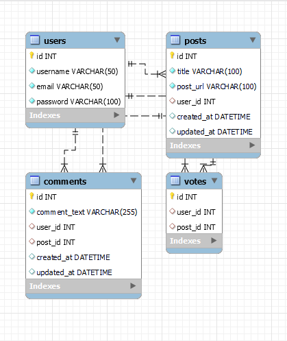

# Python Newsfeed

## Table of Contents

- [Python Newsfeed](#python-newsfeed)
  - [Table of Contents](#table-of-contents)
  - [Licence](#licence)
  - [Description](#description)
  - [Schema](#schema)
  - [Installation](#installation)
  - [Usage](#usage)
  - [Technologies Used](#technologies-used)
  - [Questions](#questions)
  - [Link to GitHub repository](#link-to-github-repository)
  - [Link to Deployed application on Heroku](#link-to-deployed-application-on-heroku)

## Licence

MIT License

Copyright (c) 2021 Tudor Andrei Tocan

Permission is hereby granted, free of charge, to any person obtaining a copy
of this software and associated documentation files (the "Software"), to deal
in the Software without restriction, including without limitation the rights
to use, copy, modify, merge, publish, distribute, sublicense, and/or sell
copies of the Software, and to permit persons to whom the Software is
furnished to do so, subject to the following conditions:

The above copyright notice and this permission notice shall be included in all
copies or substantial portions of the Software.

THE SOFTWARE IS PROVIDED "AS IS", WITHOUT WARRANTY OF ANY KIND, EXPRESS OR
IMPLIED, INCLUDING BUT NOT LIMITED TO THE WARRANTIES OF MERCHANTABILITY,
FITNESS FOR A PARTICULAR PURPOSE AND NONINFRINGEMENT. IN NO EVENT SHALL THE
AUTHORS OR COPYRIGHT HOLDERS BE LIABLE FOR ANY CLAIM, DAMAGES OR OTHER
LIABILITY, WHETHER IN AN ACTION OF CONTRACT, TORT OR OTHERWISE, ARISING FROM,
OUT OF OR IN CONNECTION WITH THE SOFTWARE OR THE USE OR OTHER DEALINGS IN THE
SOFTWARE.
## Description

Python News Feed is a simple blog app that allows users to Create, Read, Update and Delete blog posts, comments and upvotes for respective posts.
Additionally, the user has to create an account with an email, username and password and has to log in to access the features of the application.

## Schema

Database Schema for the Python News-Feed App

## Installation

To install the application, follow the next steps:

- open your terminal and clone the repo using `git clone <ssh-repo-link>`;
- `cd` into the newly created folder and open it in your Code Editor;
- open PowerShell in your app root folder and create a virtual environment using `python -m venv venv` command;
- activate the virtual environment using `.\venv\Scripts\activate`;
- install dependencies using the command `pip install -r requirements.txt`;
- fill in the DB_URL in the .env file;

## Usage

- seed the databse using `python -m seeds.py`
- run the app with `python -m flask run`

## Technologies Used

Server Side
  - Flask
  - Bcrypt
  - sqlalchemy
  - PyMySQL
  - DotENV

Client Side
  - Jinja Templating Engine
  - Javascript

Database
  - MySQL
## Questions

For any questions regarding this app, please contact me via:

- Email at tudor.tocan@gmail.com
- GitHub at <https://github.com/ttudorandrei>

## Link to GitHub repository

You can view the GitHub Repository by clicking [here](https://github.com/ttudorandrei/python-newsfeed)
## Link to Deployed application on Heroku

You ca view the deployed application on Heroku by clicking [here](https://python-newsfeed-flask.herokuapp.com/)